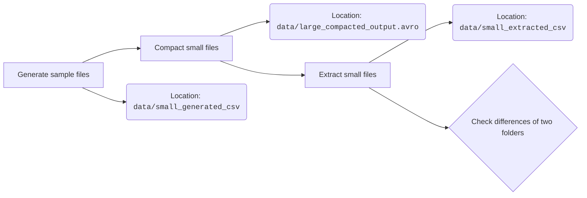

# ECE4721 Homework2

## !General Goal

> As discussed in the lectures HDFS was designed to deal with large files. Unfortunately big data does not always come as large files. In this homework we will study various approaches to mitigate this problem.

## Ex.1

1; Generate small `csv` files, run:

```shell
cd ex1
python generate.py
```

2; Find the block size on your Hadoop installation, run the command:

```shell
hdfs getconf -confKey dfs.block.size
```

in my case, I get the output as:

```shell
2025-06-04 19:29:45,680 INFO Configuration.deprecation: dfs.block.size is deprecated. Instead, use dfs.blocksize
134217728
```

which means my block size is `134217728`.

## Ex.2

1; Why we need to use `Hadoop filecrusher` in our case?

- `Hadoop filecrusher` can turns small files into fewer large ones
- `Hadoop filecrusher` change from text to sequence and other compression options in one pass
- So it means that when we deal with big data of small files, we can first use `Hadoop filecrusher` to first make them into bigger files, then `hdfs` will function better in this case.

2; Try to run it on Hadoop with the following options. Explain each the used options.

- The command being run is:

```shell
cd ex1
git clone https://github.com/edwardcapriolo/filecrush.git
cd filecrush
mvn package
cd -
hadoop jar filecrush/target/filecrush-2.2.2-SNAPSHOT.jar com.m6d.filecrush.crush.Crush -Dfs.block.size=128000000 --input-format text --clone --output-format sequence --compress gzip generated_csv/ generated_csv/out/ 20220602172400
```

- `-Dfs.block.size=128000000`: changes the block size to 128 MBs in HDFS.
- `--input-format text`: decide the input format, whether `text` or `sequence`
  - > Fully qualified class name of the input format for the data in a directory. Can use the "text" and "sequence" shortcuts for `org.apache.hadoop.mapred.TextInputFormat` and `org.apache.hadoop.mapred.SequenceFileInputFormat`, respectively. Defaults to sequence if no directory options are specified.
- `--clone`: decide whether to clone out the original files
  - > Use clone mode. Useful for external Hive tables. In clone mode, the small files are replaced with the larger files. The small files are moved to a subdirectory of the output dir argument. The subdirectory is same as the original directory rooted at output dir. For example, assume the input dir argument and output dir argument are `/user/example/input` and `/user/example/output`, respectively. If a file was originally `/user/example/input/my-dir/smallfile`, then after the clone, the original file would be located in `/user/example/output/user/example/input/my-dir/smallfile`.
- `--output-format sequence`: decide the output format, whether `text` or `sequence`
  - > Fully qualified class name of the output format to use when writing the output file for a directory. Can use the "text" and "sequence" shortcuts for `org.apache.hadoop.mapred.TextOutputFormat` and `org.apache.hadoop.mapred.SequenceFileOutputFormat`, respectively. Defaults to sequence if no directory options are specified.
- `--compress gzip`: decide whether to compress files.
  - > Fully qualified class name of the compression codec to use when writing data. It is permissible to use "none" and "gzip" to indicate no compression and `org.apache.hadoop.io.compress.GzipCodec`, respectively.

3; Try run locally

- Fail to do so, the code is too outdated with current version of `hadoop`. I got the following errors.

<details><summary>Error Message</summary>

```shell
[ERROR] Failures: 
[ERROR]   CrushTest.bucketing:682 
Expected: <[/tmp/junit7106543730832699106/in/1/1.1-0    /tmp/junit7106543730832699106/in/1/1.1/file3, /tmp/junit7106543730832699106/in/1/1.1-0       /tmp/junit7106543730832699106/in/1/1.1/file5, /tmp/junit7106543730832699106/in/1/1.1-1       /tmp/junit7106543730832699106/in/1/1.1/file1, /tmp/junit7106543730832699106/in/1/1.1-1       /tmp/junit7106543730832699106/in/1/1.1/file6, /tmp/junit7106543730832699106/in/1/1.1-2       /tmp/junit7106543730832699106/in/1/1.1/file2, /tmp/junit7106543730832699106/in/1/1.1-2       /tmp/junit7106543730832699106/in/1/1.1/file7, /tmp/junit7106543730832699106/in/1/1.2-0       /tmp/junit7106543730832699106/in/1/1.2/file1, /tmp/junit7106543730832699106/in/1/1.2-0  /tmp/junit7106543730832699106/in/1/1.2/file2, /tmp/junit7106543730832699106/in/2-1   /tmp/junit7106543730832699106/in/2/file2, /tmp/junit7106543730832699106/in/2-1       /tmp/junit7106543730832699106/in/2/file3, /tmp/junit7106543730832699106/in/2/2.2-1   /tmp/junit7106543730832699106/in/2/2.2/file1, /tmp/junit7106543730832699106/in/2/2.2-1       /tmp/junit7106543730832699106/in/2/2.2/file2, /tmp/junit7106543730832699106/in/2/2.4/2.4.2-0 /tmp/junit7106543730832699106/in/2/2.4/2.4.2/file1, /tmp/junit7106543730832699106/in/2/2.4/2.4.2-0   /tmp/junit7106543730832699106/in/2/2.4/2.4.2/file2, /tmp/junit7106543730832699106/in/2/2.4/2.4.2-0   /tmp/junit7106543730832699106/in/2/2.4/2.4.2/file3]>
     got: <[/tmp/junit7106543730832699106/in/1/1.1-0    /tmp/junit7106543730832699106/in/1/1.1/file5, /tmp/junit7106543730832699106/in/1/1.1-0       /tmp/junit7106543730832699106/in/1/1.1/file6, /tmp/junit7106543730832699106/in/1/1.1-1       /tmp/junit7106543730832699106/in/1/1.1/file1, /tmp/junit7106543730832699106/in/1/1.1-1       /tmp/junit7106543730832699106/in/1/1.1/file3, /tmp/junit7106543730832699106/in/1/1.1-2       /tmp/junit7106543730832699106/in/1/1.1/file2, /tmp/junit7106543730832699106/in/1/1.1-2       /tmp/junit7106543730832699106/in/1/1.1/file7, /tmp/junit7106543730832699106/in/1/1.2-0       /tmp/junit7106543730832699106/in/1/1.2/file1, /tmp/junit7106543730832699106/in/1/1.2-0  /tmp/junit7106543730832699106/in/1/1.2/file2, /tmp/junit7106543730832699106/in/2-1   /tmp/junit7106543730832699106/in/2/file3, /tmp/junit7106543730832699106/in/2-1       /tmp/junit7106543730832699106/in/2/file4, /tmp/junit7106543730832699106/in/2/2.2-1   /tmp/junit7106543730832699106/in/2/2.2/file1, /tmp/junit7106543730832699106/in/2/2.2-1       /tmp/junit7106543730832699106/in/2/2.2/file2, /tmp/junit7106543730832699106/in/2/2.4/2.4.2-0 /tmp/junit7106543730832699106/in/2/2.4/2.4.2/file1, /tmp/junit7106543730832699106/in/2/2.4/2.4.2-0   /tmp/junit7106543730832699106/in/2/2.4/2.4.2/file2, /tmp/junit7106543730832699106/in/2/2.4/2.4.2-0   /tmp/junit7106543730832699106/in/2/2.4/2.4.2/file3]>

[INFO] 
[ERROR] Tests run: 98, Failures: 1, Errors: 0, Skipped: 0
[INFO] 
[INFO] ------------------------------------------------------------------------
[INFO] BUILD FAILURE
[INFO] ------------------------------------------------------------------------
[INFO] Total time:  09:39 min
[INFO] Finished at: 2025-06-04T20:08:30+08:00
[INFO] ------------------------------------------------------------------------
[ERROR] Failed to execute goal org.apache.maven.plugins:maven-surefire-plugin:3.2.5:test (default-test) on project filecrush: There are test failures.
[ERROR] 
[ERROR] Please refer to /home/nuvole0217/Desktop/ece4721-submission/ex1/filecrush/target/surefire-reports for the individual test results.
[ERROR] Please refer to dump files (if any exist) [date].dump, [date]-jvmRun[N].dump and [date].dumpstream.
[ERROR] -> [Help 1]
[ERROR] 
[ERROR] To see the full stack trace of the errors, re-run Maven with the -e switch.
[ERROR] Re-run Maven using the -X switch to enable full debug logging.
[ERROR] 
[ERROR] For more information about the errors and possible solutions, please read the following articles:
[ERROR] [Help 1] http://cwiki.apache.org/confluence/display/MAVEN/MojoFailureException
```

</details>

## Ex.3

- `groupBy=PATTERN`: It enable us to freely customize our own patterns of grouping small files, and then concatenate them into larger files, so that we can properly process it using `hdfs` later.

<details><summary>Original documentation</summary>

> A regular expression that causes S3DistCp to concatenate files that match the expression. For example, you could use this option to combine all of the log files written in one hour into a single file. The concatenated filename is the value matched by the regular expression for the grouping.
>
> Parentheses indicate how files should be grouped, with all of the items that match the parenthetical statement being combined into a single output file. If the regular expression does not include a parenthetical statement, the cluster fails on the S3DistCp step and return an error.
>
> If the regular expression argument contains special characters, such as an asterisk (*), either the regular expression or the entire `--args` string must be enclosed in single quotes (').
>
> When `--groupBy` is specified, only files that match the specified pattern are copied. You do not need to specify `--groupBy` and `--srcPattern` at the same time.
>
> Example: `--groupBy=.*subnetid.*([0-9]+-[0-9]+-[0-9]+-[0-9]+).*`

</details>

- Other options that may help:
  - `--targetSize=SIZE`: enble us to specify the size of the output files, after `--groupBy`.
  - `--outputManifest=FILENAME`: compress the output using `Gzip`
  - `--src=LOCATION`: source file location
  - `--dest=LOCATION`: output file location
  - `--outputCodec=CODEC`: specifies the compression format for output files.

## Ex.4

1; What is the Snappy codec?

- Snappy is a compression and decompression library, designed for speed over maximum compression ratio. It is particularly well-suited for scenarios where fast processing is more important than achieving the smallest possible file size

2; When is it best used?

- Need fast compression/decompression (e.g., GBs per second).
- Are dealing with large volumes of data.
- Can tolerate a slightly larger file size for a significant speed gain.
- Want to avoid CPU bottlenecks caused by heavier algorithms like gzip or bzip2.

3; The json schema I designed as below, which can be found in `ex4/json/schema.json`.

<details><summary>Json source code</summary>

```json
{
  "fields": [
    {
      "name": "filename",
      "type": "string",
      "doc": "The name of the file"
    },
    {
      "name": "filecontent",
      "type": "bytes",
      "doc": "The binary content of the file"
    },
    {
      "name": "checksum",
      "type": "string",
      "doc": "SHA-1 checksum of the file"
    }
  ],
  "type": "record",
  "name": "AvroFileRecord",
  "namespace": "avro"
}
```

</details>

- General workflows described below


